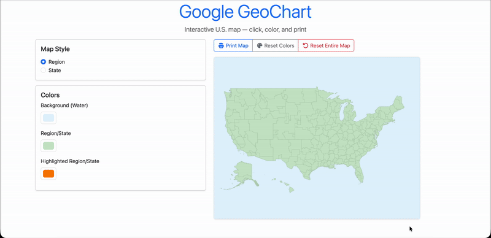
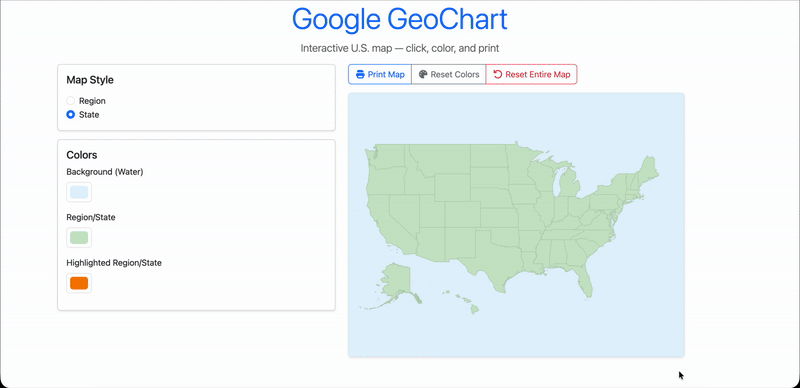
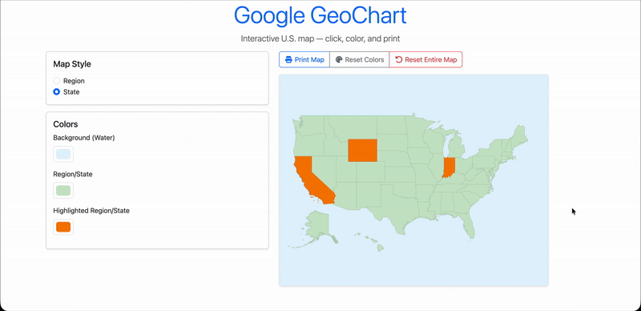
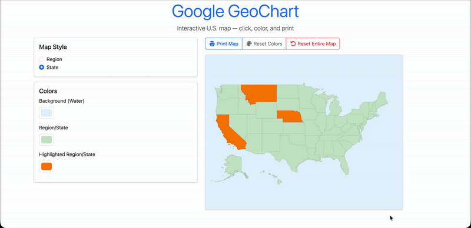
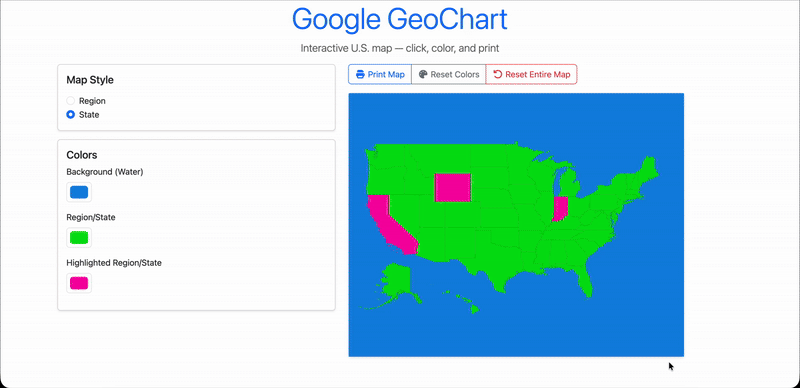

# Google GeoChart

## Overview

Google GeoChart is an interactive map of the United States that allows users to highlight regions or states, customize colors, and print the map. It is built using the Google Charts GeoChart API: https://developers.google.com/chart/interactive/docs/gallery/geochart

This chart supports two display modes:

- Region mode: Colors entire regions of the US.
- State mode: Colors individual states of the US.

## Features

- **Switch between Region and State views**  
  

- **Click to highlight or unhighlight regions/states**  
  

- **Customize map colors**  
  

- **Print the map**  
  

- **Reset map colors and selections**  
  

## Live Demo

https://google-geochart.pages.dev/
